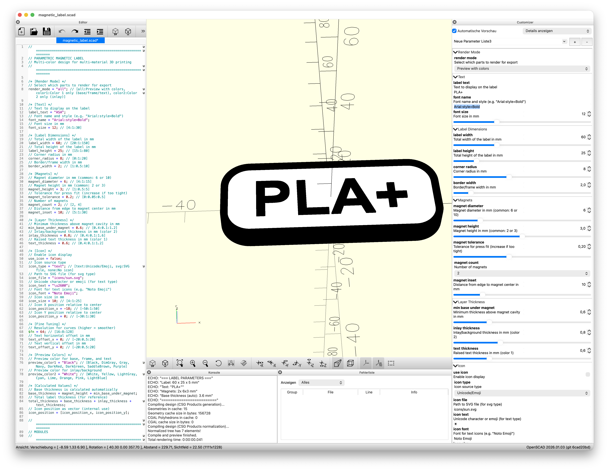

# User Guide: Parametric Magnetic Label Generator

This project generates parametric, magnetic labels in OpenSCAD -- optimized for multi-material 3D printing with two colors. The labels consist of a base plate with magnet cavities, a frame, an inlay surface, and raised text (optionally with an icon). Two separate STL files enable export for multi-material printers.


---

## Table of Contents

1. [Prerequisites](#prerequisites)
2. [Using OpenSCAD](#using-openscad)
3. [Using the CLI Export](#using-the-cli-export)
4. [Model Capabilities](#model-capabilities)
5. [Tutorial: Custom Labels with Existing Magnets](#tutorial-custom-labels-with-existing-magnets)
6. [Layer Structure](#layer-structure)
7. [Printing Tips](#printing-tips)

---

## Prerequisites

| Component | Version | Note |
|---|---|---|
| [OpenSCAD](https://openscad.org/) | 2021.01 or newer | For model preview, Customizer, and STL export |
| Python | 3.8+ | Only required for the CLI export tool |
| Multi-material printer | -- | e.g. Bambu Lab with AMS, Prusa MMU (optional -- single-color printing works too) |

---

## Using OpenSCAD

### Opening the Model

1. Open the file `magnetic_label.scad` in OpenSCAD.
2. Activate the Customizer panel via **View --> Customizer**.
3. In the Customizer you will see all parameters, grouped by category.



### Preview and Rendering

- **F5** -- Quick preview (Preview). Displays the model with colors, ideal for checking.
- **F6** -- Full render. Required before STL export.

### Parameters in the Customizer

The Customizer displays all parameters in clearly organized groups. The following table lists all available parameters:

#### Render Mode

| Parameter | Type | Default | Options | Description |
|---|---|---|---|---|
| `render_mode` | Dropdown | `"all"` | `all`, `color1`, `color2` | Determines which parts are rendered. `all` shows the colored preview, `color1` and `color2` are used for export. |

#### Text

| Parameter | Type | Default | Range | Description |
|---|---|---|---|---|
| `label_text` | String | `"ASA"` | -- | The text displayed on the label |
| `font_name` | String | `"Arial:style=Bold"` | -- | Font and style (OpenSCAD font name) |
| `font_size` | Number | `12` | 4 -- 30 mm | Font size in mm |

#### Label Dimensions

| Parameter | Type | Default | Range | Description |
|---|---|---|---|---|
| `label_width` | Number | `60` | 20 -- 150 mm | Total width of the label |
| `label_height` | Number | `25` | 15 -- 80 mm | Total height of the label |
| `corner_radius` | Number | `8` | 0 -- 20 mm | Corner radius for rounded corners |
| `border_width` | Number | `2` | 1 -- 10 mm | Width of the frame around the inlay |

#### Magnets

| Parameter | Type | Default | Range | Description |
|---|---|---|---|---|
| `magnet_diameter` | Number | `6` | 4 -- 15 mm | Diameter of the magnet |
| `magnet_height` | Number | `3` | 1 -- 5 mm | Height of the magnet |
| `magnet_tolerance` | Number | `0.2` | 0 -- 0.5 mm | Additional clearance for press fit |
| `magnet_count` | Dropdown | `2` | `2`, `4` | Number of magnets (2 = left/right, 4 = corners) |
| `magnet_inset` | Number | `10` | 5 -- 30 mm | Distance from the edge to the magnet center |

#### Layer Thickness

| Parameter | Type | Default | Range | Description |
|---|---|---|---|---|
| `min_base_under_magnet` | Number | `0.6` | 0.4 -- 1.2 mm | Minimum material thickness above the magnet cavity |
| `inlay_thickness` | Number | `0.8` | 0.4 -- 1.6 mm | Thickness of the inlay layer (Color 2) |
| `text_thickness` | Number | `0.6` | 0.4 -- 1.2 mm | Height of the raised text (Color 1) |

> **Automatically calculated values:**
> - `base_thickness` = `magnet_height` + `min_base_under_magnet` (Default: 3 + 0.6 = 3.6 mm)
> - `total_thickness` = `base_thickness` + `inlay_thickness` + `text_thickness` (Default: 3.6 + 0.8 + 0.6 = 5.0 mm)

#### Icon

| Parameter | Type | Default | Range | Description |
|---|---|---|---|---|
| `use_icon` | Boolean | `false` | -- | Enables the icon display |
| `icon_type` | Dropdown | `"text"` | `text`, `svg`, `none` | Source of the icon: Unicode character or SVG file |
| `icon_file` | String | `"icons/sun.svg"` | -- | Path to the SVG file (when `icon_type = "svg"`) |
| `icon_text` | String | `"\u2600"` (sun symbol) | -- | Unicode character (when `icon_type = "text"`) |
| `icon_font` | String | `"Noto Emoji"` | -- | Font for text icons |
| `icon_size` | Number | `10` | 4 -- 25 mm | Size of the icon in mm |
| `icon_position_x` | Number | `-18` | -50 -- 50 mm | Horizontal position relative to the center |
| `icon_position_y` | Number | `0` | -30 -- 30 mm | Vertical position relative to the center |

#### Fine Tuning

| Parameter | Type | Default | Range | Description |
|---|---|---|---|---|
| `$fn` | Number | `64` | 16 -- 128 | Resolution for curves (higher = smoother, but slower) |
| `text_offset_x` | Number | `0` | -20 -- 20 mm | Horizontal text offset |
| `text_offset_y` | Number | `0` | -20 -- 20 mm | Vertical text offset |

#### Preview Colors

| Parameter | Type | Default | Options | Description |
|---|---|---|---|---|
| `preview_color1` | Dropdown | `"Black"` | Black, DimGray, Gray, Navy, DarkRed, DarkGreen, SaddleBrown, Purple | Preview color for base, frame, and text |
| `preview_color2` | Dropdown | `"White"` | White, Yellow, LightGray, Cyan, Lime, Orange, Pink, LightBlue | Preview color for the inlay |

### Export Workflow for Two Colors

For multi-color printing, two separate STL files must be exported:

**Step 1 -- Export Color 1 (Base, Frame, Text)**

1. Set `render_mode` in the Customizer to **"color1"**.
2. Press **F6** to render.
3. Select **File --> Export --> Export as STL**.
4. Save as e.g. `label_color1.stl`.

**Step 2 -- Export Color 2 (Inlay/Background)**

1. Set `render_mode` in the Customizer to **"color2"**.
2. Press **F6** to render.
3. Select **File --> Export --> Export as STL**.
4. Save as e.g. `label_color2.stl`.

**Step 3 -- Combine in Slicer**

1. Import both STL files into your slicer.
2. The parts will automatically position themselves correctly (same origin).
3. Assign different colors or extruders to the parts.

**Alternative: Command-Line Export**

```bash
# Color 1 (Base, Frame, Text)
openscad -o label_color1.stl -D 'render_mode="color1"' magnetic_label.scad

# Color 2 (Inlay/Background)
openscad -o label_color2.stl -D 'render_mode="color2"' magnetic_label.scad
```

---

## Using the CLI Export

The Python-based export tool provides an interactive workflow that automatically calculates the optimal label size and exports both STL files in a single run.

### Getting Started

```bash
./export
```

On the first run, the following happens automatically:

1. A Python virtual environment (`venv/`) is created in the project directory.
2. The dependencies (`pillow`, `rich`) are installed.
3. The interactive export tool starts.

On every subsequent run, the existing `venv` is reused.

### Interactive Workflow

The tool guides you through the following steps:

| Step | What Happens |
|---|---|
| **1. Enter text** | You enter the label text (Default: `"ASA"`). |
| **2. Choose font size** | Specify font size in mm (Default: `12`). |
| **3. Size calculation** | The tool calculates the optimal label size based on the actual text width. It first attempts to measure the text width directly via OpenSCAD (most accurate method). If that is not possible, it falls back to PIL or a character-based approximation. You can accept the calculated size or adjust it manually. |
| **4. Foreground color** | Choose the color for base, frame, and text (e.g. Black, Navy, DarkRed). |
| **5. Background color** | Choose the color for the inlay (e.g. White, Yellow, Cyan). |
| **6. Filenames** | Confirm or change the output filenames (Default: `label_<text>_color1.stl` and `label_<text>_color2.stl`). |
| **Summary** | All parameters are displayed in a clear overview. After confirmation, the export begins. |

### Important Note About Magnets in CLI Export

**The CLI export tool uses the default magnet size: diameter 6 mm, height 3 mm.** These values are hard-coded in the tool and cannot be changed via the CLI. If you want to use different magnets, you need to adjust the parameters `magnet_diameter`, `magnet_height`, and optionally `magnet_tolerance` directly in OpenSCAD via the Customizer and perform the export manually (see [Using OpenSCAD](#using-openscad)).

### Prerequisites for the CLI Tool

- Python 3.8 or newer
- OpenSCAD must be installed (automatically searched at `/Applications/OpenSCAD.app/Contents/MacOS/OpenSCAD`, `/usr/bin/openscad`, or in the `PATH`)

---

## Model Capabilities

### Label Dimensions

The overall size of the label is controlled via `label_width` and `label_height`. The `corner_radius` determines the rounding of the corners -- at `0` you get sharp corners. The `border_width` defines how wide the frame around the inlay is.

### Typography

The text is set with `label_text`. You can change the font via `font_name` -- use the OpenSCAD notation with style specification, e.g. `"Arial:style=Bold"` or `"Helvetica:style=Regular"`. The font size (`font_size`) determines the height in mm. With `text_offset_x` and `text_offset_y` you shift the text relative to the center of the inlay.

### Icons

The model supports two types of icons:

**SVG Files:**
1. Place the SVG file in the `icons/` directory.
2. Set `use_icon = true` and `icon_type = "svg"`.
3. Enter the path in `icon_file`, e.g. `"icons/my-icon.svg"`.
4. SVG files are assumed to be 100x100 units and scaled via `icon_size`.

**Unicode Characters / Emoji:**
1. Set `use_icon = true` and `icon_type = "text"`.
2. Enter the character in `icon_text`, e.g. `"\u2600"` for a sun symbol.
3. Choose a suitable font in `icon_font` (e.g. `"Noto Emoji"`).

You control the position and size of the icon via `icon_size`, `icon_position_x`, and `icon_position_y`.

### Magnet Configuration

You can choose between 2 and 4 magnets:
- **2 magnets:** Positioned left and right, suitable for most labels.
- **4 magnets:** Positioned in the four corners, for larger labels or stronger adhesion.

The magnet size is defined via `magnet_diameter` and `magnet_height`. Common sizes are 6x3 mm and 10x2 mm. The parameter `magnet_inset` determines the distance from the label edge to the magnet center. The `magnet_tolerance` adds additional clearance to the cavity (Default: 0.2 mm).

### Preview Colors

The parameters `preview_color1` and `preview_color2` only affect the preview in OpenSCAD (F5). They have no influence on the exported STL files -- the color assignment is done in the slicer.

### Layer Thicknesses

The three layer thickness parameters (`min_base_under_magnet`, `inlay_thickness`, `text_thickness`) determine the vertical structure of the label. Thinner values result in a slimmer label, thicker values increase stability. The base thickness is automatically calculated from the magnet height plus the minimum material above it.

---

## Tutorial: Custom Labels with Existing Magnets

If you already have magnets that you want to use, follow this tutorial.

### Step 1: Measure Your Magnets

Measure your magnets with a caliper:
- **Diameter:** Measure the outer diameter of the magnet.
- **Height:** Measure the thickness/height of the magnet.

Note both values in millimeters.

### Step 2: Adjust Parameters in OpenSCAD

Open `magnetic_label.scad` and adjust the following parameters in the Customizer (or directly in the code):

| Parameter | Enter | Example |
|---|---|---|
| `magnet_diameter` | Measured diameter | `10` (for 10 mm magnets) |
| `magnet_height` | Measured height | `2` (for 2 mm magnets) |
| `magnet_tolerance` | Clearance for press fit | `0.2` (default, increase if needed) |
| `magnet_count` | Number of magnets | `2` or `4` |
| `magnet_inset` | Distance from edge to magnet center | `10` (adjust if magnets are too close to the edge) |

### Step 3: Understand the Effects on Label Geometry

The magnet size directly affects the label geometry:

**Base thickness (automatically calculated):**
```
base_thickness = magnet_height + min_base_under_magnet
```

| Magnet Height | min_base_under_magnet | Resulting Base Thickness |
|---|---|---|
| 2 mm | 0.6 mm | 2.6 mm |
| 3 mm | 0.6 mm | 3.6 mm |
| 5 mm | 0.6 mm | 5.6 mm |

**Total label thickness:**
```
total_thickness = base_thickness + inlay_thickness + text_thickness
```
With default values for `inlay_thickness` (0.8 mm) and `text_thickness` (0.6 mm), this results in:

| Magnet Height | Total Thickness |
|---|---|
| 2 mm | 4.0 mm |
| 3 mm | 5.0 mm |
| 5 mm | 7.0 mm |

**Minimum label width:** The label width must be large enough to accommodate the magnet cavities. For 2 magnets, the approximate minimum width is:
```
min_label_width = 2 * magnet_inset + magnet_diameter
```
Example: With `magnet_inset = 10` and `magnet_diameter = 10`, the minimum width is approximately 30 mm.

### Step 4: Adjust Tolerance

The `magnet_tolerance` determines how much additional diameter is added to the cavity:

- **0.1 -- 0.2 mm:** Press fit (magnet sits tight, hard to remove)
- **0.2 -- 0.3 mm:** Standard (magnet sits securely, but removable)
- **0.3 -- 0.4 mm:** Loose fit (magnet falls out when the label is flipped)

**Recommendation:** Print a small test piece with the default tolerance of 0.2 mm. If the magnet fits too tightly, increase to 0.3 mm. Too loose: reduce to 0.15 mm.

> The optimal tolerance depends on your printer, filament, and print orientation. Every printer behaves slightly differently.

---

## Layer Structure

The label consists of four layers, built from bottom to top:

```
Side View:

    Text (0.6 mm)      ###           -- Color 1 (e.g. Black)
    Inlay (0.8 mm)     ...........   -- Color 2 (e.g. White)
    Frame              ###     ###   -- Color 1
    Base (3.6 mm)      ###########   -- Color 1
                        O         O   -- Magnet Cavities
```

| Layer | Module | Color | Description |
|---|---|---|---|
| **Base** | `base_plate()` | Color 1 | Base plate with magnet cavities on the bottom side. Thickness is automatically calculated from `magnet_height + min_base_under_magnet`. |
| **Frame** | `frame()` | Color 1 | Raised border around the inlay. Height equals `inlay_thickness + text_thickness`. |
| **Inlay** | `inlay()` | Color 2 | Background surface inside the frame. This is where the second color comes into play. |
| **Text / Icon** | `label_text_3d()`, `icon()` | Color 1 | Raised text and optional icon on the inlay. |

**Color groups for export:**

- **`color1`** (= `color1_parts()`): Base + Frame + Text + Icon -- typically the darker color
- **`color2`** (= `color2_parts()`): Inlay -- typically the lighter color

---

## Printing Tips

### Printer Settings

| Setting | Recommendation | Reason |
|---|---|---|
| Layer height | 0.16 -- 0.2 mm | Good balance between quality and print time. For particularly sharp text edges: 0.12 mm. |
| Infill | 20 -- 40 % | The label is thin enough that high infill provides little benefit. |
| Walls | 2 -- 3 perimeters | Sufficient for stability. |
| Support material | Not needed | The model is designed so that no support is required. |
| Print orientation | Bottom side on the print bed | The magnet cavities face downward and are printed as closed pockets. |

### Multi-Color Printing

- Import both STL files into your slicer and assign different extruders/colors to them.
- Use a purge tower or wipe tower for clean color changes.
- The parts share the same origin and fit together automatically.
- Test the filament change with a test piece before printing many labels.

### Material

- **PLA:** Well suited for indoor labels. Wide range of colors available.
- **PETG:** More robust than PLA, slightly more flexible. Good choice for labels that are moved frequently.
- **ASA/ABS:** UV-resistant, suitable for outdoor use. Requires a heated print bed and possibly an enclosure.

### Testing Magnet Fit

Before producing a full label, print a small test piece:
1. Create a basic label with minimal size.
2. Print it and check whether the magnet fits into the cavity.
3. The magnet should snap in with slight pressure (press fit) and not fall out on its own.
4. Adjust `magnet_tolerance` if needed (see [Adjust Tolerance](#step-4-adjust-tolerance)).

### Resolution for Export

- Use `$fn = 32` or `$fn = 48` during preview (F5) for faster display.
- For the final STL export, set `$fn = 64` or higher -- the rounded corners will appear smoother.
- Higher values (e.g. 128) further improve quality but significantly increase render time.

### Common Problems

| Problem | Cause | Solution |
|---|---|---|
| Magnet does not fit into the cavity | Tolerance too small | Increase `magnet_tolerance` to 0.3 or 0.4 |
| Magnet falls out | Tolerance too large | Reduce `magnet_tolerance` to 0.1 -- 0.15 |
| Text is cut off | Label too small for the text | Increase `label_width` or `label_height`, or reduce `font_size` |
| Frame is not visible | `border_width` too small or `corner_radius` too large | Increase `border_width` or reduce `corner_radius` |
| Colors in slicer are wrong | Wrong `render_mode` during export | Ensure that `color1` and `color2` were exported separately |
| CLI tool cannot find OpenSCAD | OpenSCAD not installed or not in search path | Install OpenSCAD or check the path |
